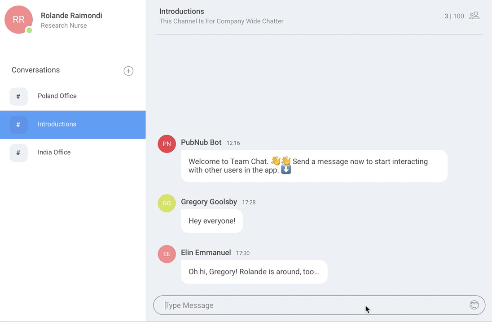

# React chat app

Create a chat app in ReactJS which sends chat message.

## Basic Task

In this assignment you will need to create a ReactJS chat application.

This will be a single page application, which will have a textbox to type the message and a button to send the chat.

On clicking send button, show the chat message above the textbox(Refer the image). You need not have to develop the sidebar in the image. Just focus on the chat input box and the chat message thread.

For each message randomly assign a username from the below user list.

```javascript
const user_list = ["Alan", "Bob", "Carol", "Dean", "Elin"];
```

For each message, add a like button at the right end of the chat message, which on click should increase the count. Display the count next to the like button.



## (Optional: Attempt 1 or More) Stretch Goals

1. Add emoji options in the chat message
2. Add mentions(@) feature. On clikcing '@' show the list of users in the user list.
3. Create a websocket(socket.io) server using express.js and establish a client and server communication using socket.io publish and subscribe.
